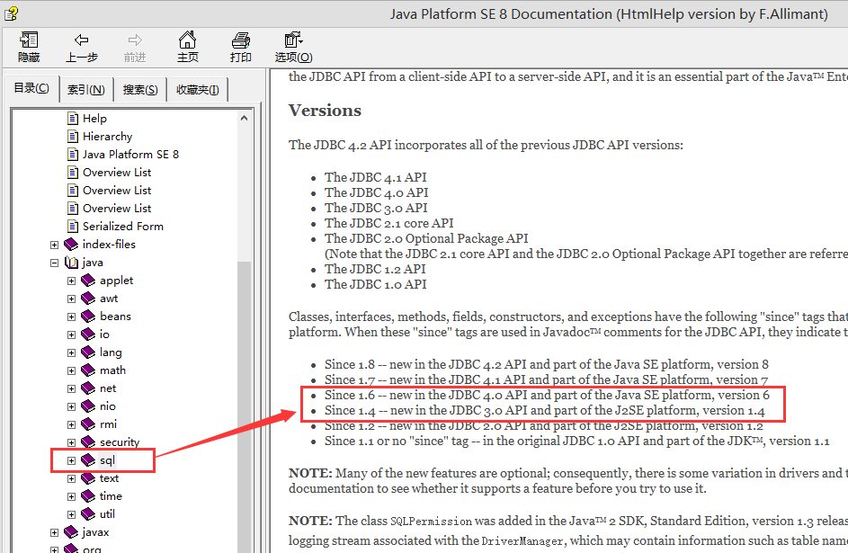
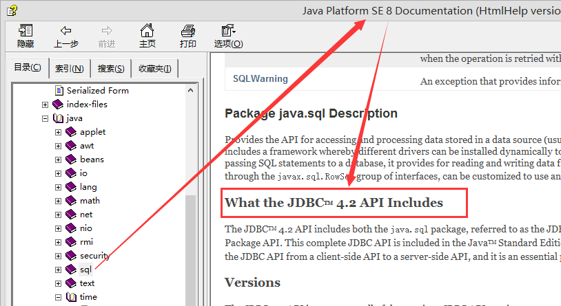
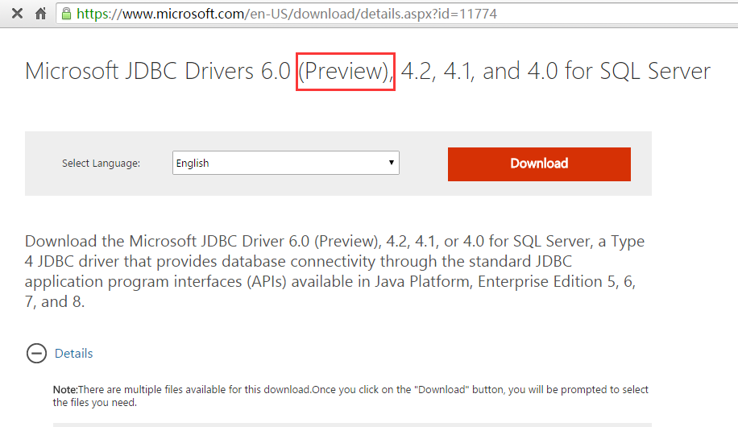

# ojdbc14.jar 和 ojdbc6.jar 有什么区别？
ojdbc14.jar 和 ojdbc6.jar 都是 oracle 的驱动，命名为什么差好几个数字，从字面上能看出什么，我觉得这个问题，要适当普及一下了，是这样的：

> ojdbc6 全称是 oracle jdbc driver since jdk 1.6
> ojdbc14 全称是 oracle jdbc driver since jdk 1.4

从 1.5 开始，jdk 就开始以 5 为基数大跃进了，所以驱动名称上也能体现出来，为什么是 ojdbc6 而不是 ojdbc16.
那从驱动名字上能看出什么呢？且看下面这张图：

可以看到，since 1.6 表示驱动实现了 jdbc4.0 规范，since 1.4 表示驱动实现了 jdbc 3.0 规范。
__小结__：

| 驱动简称 |             驱动全称             | 实现的JDBC规范 |
|----------|----------------------------------|----------------|
| ojdbc6   | oracle jdbc driver since jdk 1.6 | JDBC4.0        |
| ojdbc14  | oracle jdbc driver since jdk 1.4 | JDBC3.0        |

__什么？ jdbc 还是个规范？__
当然是规范了，数据库驱动只是这个规范的实现而已。

那了解数据库驱动所实现的 JDBC 规范版本有什么用呢？举例如下：
java 8 的 datetime api 很好用, 如果希望使用 hibernate 时，将 java.time.LocalDateTime 属性直接映射为数据库的 timestamp/datetime 字段内，你需要先了解两件事
__1. 查询 java 8 对应的 JDBC 是哪个版本__

查询发现 jdk 8 需要 JDBC 4.2 兼容的驱动
__2. 查询数据库驱动是否实现了 JDBC 4.2，以 SQLServer 驱动为例：__

可以看到微软实现了 JDBC 4.2 驱动，下载即可安装后提取其中的 jar 即可。
